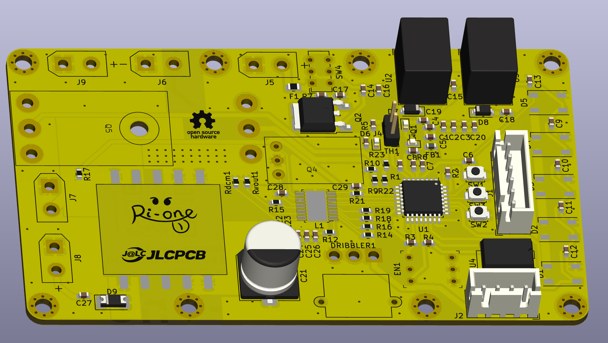
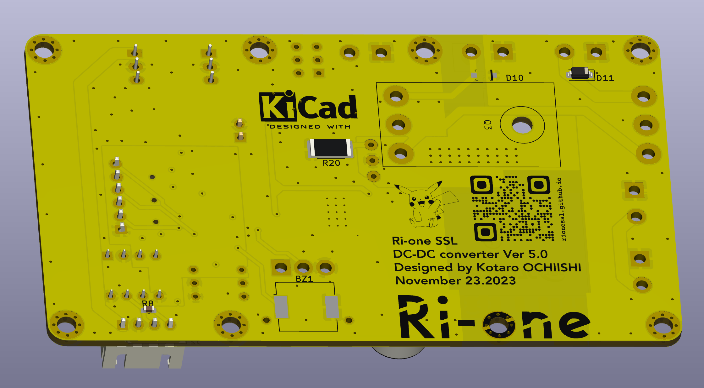

# SSL　SubBoard

## Overview

This is a sub-board installed in the SSL robot.
The boost circuit, neopixel, phototransistor, etc. are controlled by stm32, and CAN communication is performed with the main board.

## Requirement

- KiCad 7.0.5

## Usage

Good luck...

## Features

This is a sub-board installed in an SSL robot. The board is equipped with various components such as a boost circuit, NeoPixels, phototransistors, etc., all controlled by an STM32 microcontroller. 

- This microcontroller offers advanced programming and processing capabilities, efficiently managing the robot's diverse functions.

- The boost circuit optimizes power supply, ensuring each component on the board operates at the correct voltage. It elevates the low voltage from the battery, distributing power as needed.

- NeoPixels are individually controllable LEDs used for visual feedback and status indication on the robot. These LEDs can be customized in color and brightness through programming, intuitively conveying the robot's status to the operator.

- Phototransistors detect light intensity and convert this information into digital signals. This is a crucial sensor for environmental awareness and obstacle detection in the robot.

- Furthermore, this robot is equipped with a thermistor for measuring the temperature of the solenoid coil. The thermistor plays a vital role in monitoring the heat generated by the solenoid, preventing overheating and enhancing the robot's safety and equipment lifespan.

- Additionally, the sub-board incorporates protective circuits around the power supply, safeguarding it against overvoltage and short circuits. 

- These circuits are essential for maintaining power stability while minimizing electrical risks.

- The sub-board communicates with the main board using the CAN communication protocol. CAN communication is known for its high reliability and error detection capabilities, ensuring secure data exchange between different parts of the robot. This allows for smooth overall operation and the ability to perform more complex tasks.

In this way, the sub-board supports crucial functions of the SSL robot, drawing out the robot's maximum performance through advanced technology and meticulous design.

  
  

## Reference

https://www.analog.com/media/jp/technical-documentation/data-sheets/j3751fc.pdf

## Author

[@Allsatako](http://twitter.com/Allsatako)

mail to: rionesslq@gmail.com

## Licence

There is no license as this is open source hardware.
